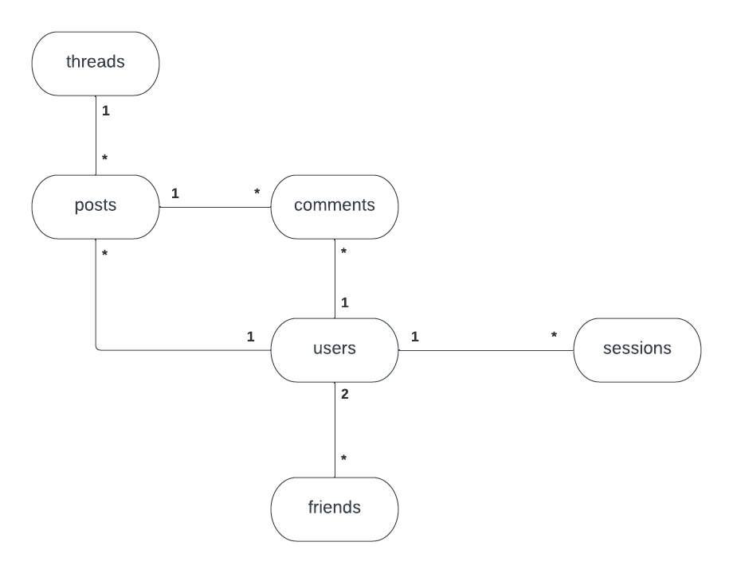
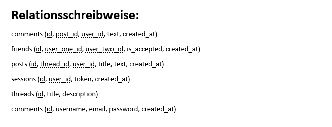

# forum

## Projektauftrag

1. Überlegen Sie sich ein Thema, zu dem Sie eine Datenbank erstellen wollen. Die Datenbank sollte mindestens sechs Tabellen umfassen.
2. Planen Sie die Datenbank mit einem ER-Diagramm.
3. Geben Sie die Datenbank in Relationsschreibweise an.
4. Füllen Sie die Datenbank mit ausreichend Inhalt.
5. Formulieren Sie 15 sinnvolle SQL-Abfragen inklusive Suchen über mehrere Tabellen und Gruppierungen.
6. Erstellen Sie eine Web-Oberfläche inklusive PHP-Skript, mit der Sie Anfragen an die Datenbank stellen können und ggf. neue Datensätze in die Datenbank einfügen können.
7. Es können Teams von maximal zwei Personen gebildet werden.

# Abgabe und Bewertungskriterien:

- ER-Modell: Bewertet wird Sinnhaftigkeit, Logik, Vollständigkeit, Richtigkeit.
- Relationsschreibweise: Darf logisch und inhaltlich dem ER-Diagramm nicht widersprechen.
- Beschreibung der Abfragen, die an die Datenbank gestellt werden sollen sowie deren Umsetzung in SQL.
- HTML- und PHP-Code.
- Datenbank: Darf inhaltlich und logisch dem ER-Modell und der Relationsschreibweise nicht widersprechen.
- Bewertet wird ferner das beobachtete Arbeitsverhalten während des Unterrichts (Schüler/in arbeitet gewissenhaft am Projekt oder nicht)
- Es werden einige Arbeiten ausgewählt, die von den zugehörigen Beteiligten präsentiert werden müssen. Die Präsentation wird mit bewertet.

---

## Aufbau

### ER-Diagramm:



### Relationsschreibweise:



---

## Datenbankabfragen

1. Alle Kommentare zu einem bestimmten Post:

```sql
SELECT c.id as comment_id,
       c.text comment_text,
       c.created_at as comment_created_at,
       u.id as user_id,
       u.username as user_username,
       u.created_at as user_created_at
  FROM forum.comments c
  LEFT JOIN forum.users u ON c.user_id = u.id
 WHERE c.post_id = ?
 ORDER BY c.created_at DESC;
```

2. Ein neues Kommentar einfügen:

```sql
INSERT INTO forum.comments
       (post_id, user_id, text)
VALUES
       (?, ?, ?);
```

3. Alle Freunde von einem User holen:

```sql
SELECT f.is_accepted, u.id, u.username, u.created_at FROM forum.friends f
  LEFT JOIN forum.users u ON f.user_one_id = u.id
 WHERE f.user_two_id = ?

 UNION ALL

SELECT f.is_accepted, u.id, u.username, u.created_at FROM forum.friends f
  LEFT JOIN forum.users u ON f.user_two_id = u.id
 WHERE f.user_one_id = ?;
```

4. Alle posts zu einem bestimmten Thread holen:

```sql
SELECT p.id as post_id,
       p.title as post_title,
       p.text as post_text,
       p.created_at as post_created_at,
       count(c.id) as comment_count,
       u.id as user_id,
       u.username as user_username,
       u.created_at as user_created_at
  FROM forum.posts p
  LEFT JOIN forum.comments c ON c.post_id = p.id
  LEFT JOIN forum.users u ON p.user_id = u.id
 WHERE p.thread_id = ?
 GROUP BY p.id
 ORDER BY post_created_at DESC;
```

5. Einen bestimmten Post holen:

```sql
SELECT p.id as post_id,
       p.title as post_title,
       p.text as post_text,
       p.created_at as post_created_at,
       count(c.id) as comment_count,
       u.id as user_id,
       u.username as user_username,
       u.created_at as user_created_at
  FROM forum.posts p
  LEFT JOIN forum.comments c ON c.post_id = p.id
  LEFT JOIN forum.users u ON p.user_id = u.id
 WHERE p.id = ?
 GROUP BY p.id
 ORDER BY post_created_at DESC;
```

6. Die x neusten Posts holen:

```sql
SELECT p.id as post_id,
       p.title as post_title,
       p.text as post_text,
       p.created_at as post_created_at,
       count(c.id) as comment_count,
       u.id as user_id,
       u.username as user_username,
       u.created_at as user_created_at
  FROM forum.posts p
  LEFT JOIN forum.comments c ON c.post_id = p.id
  LEFT JOIN forum.users u ON p.user_id = u.id
 GROUP BY p.id
 ORDER BY p.created_at DESC
 LIMIT ?;
```

7. Einen neuen Post hinzufügen:

```sql
INSERT INTO forum.posts
       (thread_id, user_id, title, text)
VALUES
       (?, ?, ?, ?);
```

8. Eine Session löschen:

```sql
DELETE FROM forum.sessions
 WHERE user_id = ?;
```

9. Eine Session einfügen

```sql
INSERT INTO forum.sessions
       (user_id, token)
VALUES
       (?, ?);
```

10. Alle Threads holen:

```sql
SELECT t.id as thread_id,
       t.title,
       t.description
  FROM forum.threads t
 ORDER BY t.id ASC;
```

11. Einen Thread holen:

```sql
SELECT t.id as thread_id,
       t.title,
       t.description
  FROM forum.threads t
 WHERE t.id = ?;
```

12. Die Anzahl der User holen:

```sql
SELECT count(*) as count
  FROM forum.users;
```

13. Den neusten User holen:

```sql
SELECT id,
       username,
       created_at
  FROM forum.users
 ORDER BY created_at DESC
 LIMIT 1;
```

14. Die Anzahl der User mit dieser Email holen:

```sql
SELECT count(*) as count
  FROM forum.users
 WHERE users.email = ?;
```

15. Die Anzahl der User mit diesem Benutzername holen:

```sql
SELECT count(*) as count
  FROM forum.users
 WHERE users.username = ?;
```

16. Den User anhand eines Tokens holen:

```sql
SELECT u.id as id,
       u.username as username,
       u.created_at as created_at
  FROM forum.users u
  LEFT JOIN forum.sessions s ON s.user_id = u.id
 WHERE s.token = ?;
```

17. Einen neuen User einfügen:

```sql
INSERT INTO forum.users
       (username, email, password)
VALUES
       (?, ?, ?);
```

18. Einen User anhand des Benutzernamen holen:

```sql
SELECT u.id as id,
       u.username as username,
       u.created_at as created_at
  FROM forum.users u
 WHERE u.username = ?;
```

19. Das Passwort eines Users anhand des Benutzernamen holen:

```sql
SELECT u.password as password
  FROM forum.users u
 WHERE u.username = ?;
```
